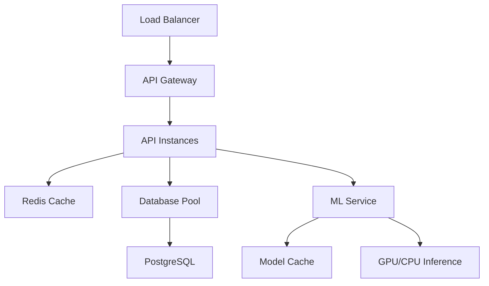

# Performance Optimization Guide

This comprehensive guide provides detailed instructions for optimizing the performance of the rental ML system across all components including APIs, databases, ML models, and infrastructure.

## Table of Contents

1. [Performance Overview](#performance-overview)
2. [API Performance Optimization](#api-performance-optimization)
3. [Database Performance Optimization](#database-performance-optimization)
4. [ML Model Performance Optimization](#ml-model-performance-optimization)
5. [Caching Strategies](#caching-strategies)
6. [System Resource Optimization](#system-resource-optimization)
7. [Monitoring and Alerting](#monitoring-and-alerting)
8. [Scalability Best Practices](#scalability-best-practices)
9. [Performance Testing](#performance-testing)
10. [Troubleshooting Guide](#troubleshooting-guide)

## Performance Overview

### Performance Targets

| Component | Metric | Target | Critical Threshold |
|-----------|--------|--------|-------------------|
| API Response Time | P95 | < 500ms | > 2s |
| API Throughput | RPS | > 100 | < 10 |
| Database Queries | Simple | < 10ms | > 100ms |
| Database Queries | Complex | < 100ms | > 1s |
| ML Inference | Single | < 50ms | > 200ms |
| ML Inference | Batch (32) | < 200ms | > 1s |
| Memory Usage | Application | < 1GB | > 4GB |
| CPU Usage | Average | < 70% | > 90% |
| Cache Hit Rate | Redis | > 80% | < 50% |

### Performance Architecture



## API Performance Optimization

### 1. Asynchronous Processing

```python
# Use async/await for I/O operations
@app.get("/api/v1/recommendations/{user_id}")
async def get_recommendations(user_id: int):
    # Concurrent execution of independent operations
    async with asyncio.TaskGroup() as tg:
        user_task = tg.create_task(get_user_preferences(user_id))
        properties_task = tg.create_task(get_available_properties())
        
    user_prefs = user_task.result()
    properties = properties_task.result()
    
    return await generate_recommendations(user_prefs, properties)
```

### 2. Request/Response Optimization

#### Response Compression
```python
from fastapi.middleware.gzip import GZipMiddleware

app.add_middleware(GZipMiddleware, minimum_size=1000)
```

#### Pagination
```python
@app.get("/api/v1/properties")
async def get_properties(
    page: int = Query(1, ge=1),
    page_size: int = Query(20, ge=1, le=100)
):
    offset = (page - 1) * page_size
    properties = await property_service.get_properties_paginated(
        offset=offset, limit=page_size
    )
    return {
        "properties": properties,
        "page": page,
        "page_size": page_size,
        "total": await property_service.count_properties()
    }
```

#### Response Model Optimization
```python
from pydantic import BaseModel, Field

class PropertySummary(BaseModel):
    """Lightweight property representation for lists"""
    id: str
    title: str
    price: float
    location: str
    image_url: Optional[str] = Field(None, alias="primary_image")
    
    class Config:
        allow_population_by_field_name = True

class PropertyDetail(PropertySummary):
    """Full property representation for detail views"""
    description: str
    amenities: List[str]
    contact_info: Dict[str, Any]
    similar_properties: List[PropertySummary] = []
```

### 3. Connection Pool Optimization

```python
import asyncpg

# Optimized connection pool configuration
async def create_optimized_pool():
    return await asyncpg.create_pool(
        dsn=DATABASE_URL,
        min_size=5,          # Minimum connections
        max_size=20,         # Maximum connections
        max_queries=50000,   # Queries per connection before refresh
        max_inactive_connection_lifetime=300,  # 5 minutes
        command_timeout=30,  # Query timeout
        server_settings={
            'application_name': 'rental-ml-api',
            'tcp_keepalives_idle': '600',
            'tcp_keepalives_interval': '30',
            'tcp_keepalives_count': '3'
        }
    )
```

### 4. Rate Limiting and Throttling

```python
from slowapi import Limiter, _rate_limit_exceeded_handler
from slowapi.util import get_remote_address

limiter = Limiter(key_func=get_remote_address)

@app.get("/api/v1/search")
@limiter.limit("100/minute")  # 100 requests per minute
async def search_properties(request: Request, query: str):
    return await search_service.search(query)

@app.get("/api/v1/recommendations/{user_id}")
@limiter.limit("20/minute")   # ML endpoints have lower limits
async def get_recommendations(request: Request, user_id: int):
    return await recommendation_service.get_recommendations(user_id)
```

## Database Performance Optimization

### 1. Query Optimization

#### Use Appropriate Indexes
```sql
-- Property search optimization
CREATE INDEX CONCURRENTLY idx_properties_location_price 
ON properties(location, price) 
WHERE is_active = true;

-- Full-text search optimization
CREATE INDEX CONCURRENTLY idx_properties_search_gin 
ON properties USING GIN(to_tsvector('english', title || ' ' || description));

-- User interaction optimization
CREATE INDEX CONCURRENTLY idx_interactions_user_property_time 
ON user_interactions(user_id, property_id, timestamp DESC);

-- Composite index for recommendations
CREATE INDEX CONCURRENTLY idx_properties_type_price_bedrooms 
ON properties(property_type, price, bedrooms) 
WHERE is_active = true;
```

#### Query Pattern Optimization
```python
# Efficient property search with proper indexing
async def search_properties_optimized(
    location: str, 
    min_price: float, 
    max_price: float,
    bedrooms: Optional[int] = None
):
    query = """
    SELECT p.id, p.title, p.price, p.location, p.bedrooms
    FROM properties p
    WHERE p.is_active = true
      AND p.location = $1
      AND p.price BETWEEN $2 AND $3
      AND ($4::int IS NULL OR p.bedrooms = $4)
    ORDER BY p.price ASC
    LIMIT 50
    """
    
    async with db_pool.acquire() as conn:
        return await conn.fetch(query, location, min_price, max_price, bedrooms)

# Efficient user interaction history
async def get_user_interaction_history(user_id: str, limit: int = 20):
    query = """
    SELECT ui.property_id, ui.interaction_type, ui.timestamp,
           p.title, p.price, p.location
    FROM user_interactions ui
    JOIN properties p ON ui.property_id = p.id
    WHERE ui.user_id = $1
    ORDER BY ui.timestamp DESC
    LIMIT $2
    """
    
    async with db_pool.acquire() as conn:
        return await conn.fetch(query, user_id, limit)
```

### 2. Connection Pool Tuning

```python
# Database configuration for high performance
DATABASE_CONFIG = {
    # Connection pool settings
    'pool_size': 20,
    'max_overflow': 40,
    'pool_timeout': 30,
    'pool_recycle': 3600,
    
    # PostgreSQL-specific optimizations
    'connect_args': {
        'server_settings': {
            'shared_preload_libraries': 'pg_stat_statements',
            'work_mem': '256MB',
            'effective_cache_size': '2GB',
            'random_page_cost': '1.1',
            'checkpoint_completion_target': '0.9',
            'wal_buffers': '16MB',
            'default_statistics_target': '100'
        }
    }
}
```

### 3. Query Performance Monitoring

```python
import time
import logging

class QueryPerformanceMiddleware:
    def __init__(self, slow_query_threshold: float = 0.1):
        self.slow_query_threshold = slow_query_threshold
        self.logger = logging.getLogger('query_performance')
    
    async def __call__(self, conn, query, *args):
        start_time = time.perf_counter()
        
        try:
            result = await conn.fetch(query, *args)
            return result
        finally:
            duration = time.perf_counter() - start_time
            
            if duration > self.slow_query_threshold:
                self.logger.warning(
                    f"Slow query detected: {duration:.3f}s - {query[:100]}..."
                )
            
            # Log to metrics system
            await self.record_query_metrics(query, duration, len(result) if result else 0)
```

## ML Model Performance Optimization

### 1. Model Inference Optimization

#### Batch Processing
```python
import asyncio
from typing import List, Dict
import numpy as np

class BatchInferenceManager:
    def __init__(self, model, batch_size: int = 32, max_wait_time: float = 0.1):
        self.model = model
        self.batch_size = batch_size
        self.max_wait_time = max_wait_time
        self.pending_requests = []
        self.processing = False
    
    async def predict_single(self, input_data: np.ndarray) -> np.ndarray:
        """Add request to batch and wait for result"""
        future = asyncio.Future()
        self.pending_requests.append((input_data, future))
        
        # Trigger batch processing if needed
        if len(self.pending_requests) >= self.batch_size:
            asyncio.create_task(self._process_batch())
        elif not self.processing:
            asyncio.create_task(self._wait_and_process())
        
        return await future
    
    async def _wait_and_process(self):
        """Wait for max_wait_time then process batch"""
        await asyncio.sleep(self.max_wait_time)
        if self.pending_requests and not self.processing:
            await self._process_batch()
    
    async def _process_batch(self):
        """Process current batch of requests"""
        if self.processing or not self.pending_requests:
            return
        
        self.processing = True
        current_batch = self.pending_requests.copy()
        self.pending_requests.clear()
        
        try:
            # Prepare batch input
            inputs = np.stack([req[0] for req in current_batch])
            
            # Run inference
            predictions = await asyncio.to_thread(self.model.predict, inputs)
            
            # Return results to futures
            for i, (_, future) in enumerate(current_batch):
                if not future.cancelled():
                    future.set_result(predictions[i])
        
        except Exception as e:
            # Set exception for all futures
            for _, future in current_batch:
                if not future.cancelled():
                    future.set_exception(e)
        
        finally:
            self.processing = False
```

#### Model Quantization
```python
import tensorflow as tf

def quantize_model(model: tf.keras.Model, 
                  quantization_type: str = "dynamic") -> tf.keras.Model:
    """Apply quantization to reduce model size and improve inference speed"""
    
    if quantization_type == "dynamic":
        # Dynamic range quantization
        converter = tf.lite.TFLiteConverter.from_keras_model(model)
        converter.optimizations = [tf.lite.Optimize.DEFAULT]
        quantized_tflite = converter.convert()
        
        # Save quantized model
        with open('quantized_model.tflite', 'wb') as f:
            f.write(quantized_tflite)
        
        return create_tflite_model_wrapper(quantized_tflite)
    
    elif quantization_type == "int8":
        # Integer quantization with calibration dataset
        converter = tf.lite.TFLiteConverter.from_keras_model(model)
        converter.optimizations = [tf.lite.Optimize.DEFAULT]
        converter.target_spec.supported_types = [tf.int8]
        
        # Provide representative dataset for calibration
        def representative_dataset():
            for sample in calibration_data:
                yield [sample.astype(np.float32)]
        
        converter.representative_dataset = representative_dataset
        quantized_tflite = converter.convert()
        
        with open('int8_quantized_model.tflite', 'wb') as f:
            f.write(quantized_tflite)
        
        return create_tflite_model_wrapper(quantized_tflite)
```

#### Model Pruning
```python
import tensorflow_model_optimization as tfmot

def create_pruned_model(model: tf.keras.Model, 
                       target_sparsity: float = 0.5) -> tf.keras.Model:
    """Apply magnitude-based pruning to reduce model size"""
    
    # Define pruning schedule
    pruning_schedule = tfmot.sparsity.keras.ConstantSparsity(
        target_sparsity=target_sparsity,
        begin_step=0
    )
    
    # Apply pruning
    pruned_model = tfmot.sparsity.keras.prune_low_magnitude(
        model,
        pruning_schedule=pruning_schedule
    )
    
    # Compile with same configuration
    pruned_model.compile(
        optimizer=model.optimizer,
        loss=model.loss,
        metrics=model.metrics
    )
    
    return pruned_model

def finalize_pruned_model(pruned_model: tf.keras.Model) -> tf.keras.Model:
    """Remove pruning wrapper and finalize model"""
    return tfmot.sparsity.keras.strip_pruning(pruned_model)
```

### 2. Model Caching Strategy

```python
import hashlib
import pickle
from typing import Optional
import redis.asyncio as redis

class ModelCacheManager:
    def __init__(self, redis_client: redis.Redis, ttl: int = 3600):
        self.redis = redis_client
        self.ttl = ttl
    
    def _create_cache_key(self, model_name: str, input_data: np.ndarray) -> str:
        """Create cache key from model name and input hash"""
        input_hash = hashlib.md5(input_data.tobytes()).hexdigest()[:16]
        return f"model_cache:{model_name}:{input_hash}"
    
    async def get_cached_prediction(self, 
                                  model_name: str, 
                                  input_data: np.ndarray) -> Optional[np.ndarray]:
        """Get cached prediction if available"""
        cache_key = self._create_cache_key(model_name, input_data)
        
        try:
            cached_data = await self.redis.get(cache_key)
            if cached_data:
                return pickle.loads(cached_data)
        except Exception as e:
            logger.warning(f"Cache get error: {e}")
        
        return None
    
    async def cache_prediction(self, 
                             model_name: str, 
                             input_data: np.ndarray, 
                             prediction: np.ndarray):
        """Cache model prediction"""
        cache_key = self._create_cache_key(model_name, input_data)
        
        try:
            cached_data = pickle.dumps(prediction)
            await self.redis.set(cache_key, cached_data, ex=self.ttl)
        except Exception as e:
            logger.warning(f"Cache set error: {e}")
    
    async def predict_with_cache(self, 
                               model_name: str, 
                               model_func: callable, 
                               input_data: np.ndarray) -> np.ndarray:
        """Predict with caching"""
        # Try cache first
        cached_result = await self.get_cached_prediction(model_name, input_data)
        if cached_result is not None:
            return cached_result
        
        # Run model inference
        prediction = await asyncio.to_thread(model_func, input_data)
        
        # Cache result
        await self.cache_prediction(model_name, input_data, prediction)
        
        return prediction
```

## Caching Strategies

### 1. Redis Configuration Optimization

```python
# Redis configuration for optimal performance
REDIS_CONFIG = {
    'host': 'localhost',
    'port': 6379,
    'db': 0,
    'max_connections': 50,
    'socket_timeout': 5,
    'socket_connect_timeout': 5,
    'health_check_interval': 30,
    'retry_on_timeout': True,
    'decode_responses': True,
    
    # Memory optimization
    'maxmemory_policy': 'allkeys-lru',  # Eviction policy
    'tcp_keepalive': True,
    
    # Persistence (adjust based on requirements)
    'save': [(900, 1), (300, 10), (60, 10000)],  # RDB snapshots
    'appendonly': True,  # AOF for durability
    'appendfsync': 'everysec'  # AOF sync frequency
}
```

### 2. Multi-Level Caching

```python
from functools import wraps
import asyncio
from typing import Any, Callable, Optional

class MultiLevelCache:
    def __init__(self, 
                 redis_client: redis.Redis, 
                 memory_cache_size: int = 1000):
        self.redis = redis_client
        self.memory_cache = {}
        self.memory_cache_size = memory_cache_size
        self.access_order = []
    
    async def get(self, key: str) -> Optional[Any]:
        """Get value with L1 (memory) -> L2 (Redis) fallback"""
        # L1 Cache (Memory)
        if key in self.memory_cache:
            # Move to end for LRU
            self.access_order.remove(key)
            self.access_order.append(key)
            return self.memory_cache[key]
        
        # L2 Cache (Redis)
        try:
            value = await self.redis.get(key)
            if value is not None:
                # Promote to L1 cache
                await self._set_memory_cache(key, value)
                return value
        except Exception as e:
            logger.warning(f"Redis get error: {e}")
        
        return None
    
    async def set(self, key: str, value: Any, ttl: int = 3600):
        """Set value in both cache levels"""
        # Set in Redis (L2)
        try:
            await self.redis.set(key, value, ex=ttl)
        except Exception as e:
            logger.warning(f"Redis set error: {e}")
        
        # Set in memory (L1)
        await self._set_memory_cache(key, value)
    
    async def _set_memory_cache(self, key: str, value: Any):
        """Set value in memory cache with LRU eviction"""
        if key in self.memory_cache:
            self.access_order.remove(key)
        elif len(self.memory_cache) >= self.memory_cache_size:
            # Evict least recently used
            lru_key = self.access_order.pop(0)
            del self.memory_cache[lru_key]
        
        self.memory_cache[key] = value
        self.access_order.append(key)

# Usage decorator
def cached(cache_key_func: Callable, ttl: int = 3600):
    def decorator(func: Callable):
        @wraps(func)
        async def wrapper(*args, **kwargs):
            cache_key = cache_key_func(*args, **kwargs)
            
            # Try cache first
            cached_result = await multi_level_cache.get(cache_key)
            if cached_result is not None:
                return cached_result
            
            # Execute function
            result = await func(*args, **kwargs)
            
            # Cache result
            await multi_level_cache.set(cache_key, result, ttl)
            
            return result
        return wrapper
    return decorator

# Example usage
@cached(
    cache_key_func=lambda user_id, limit: f"user_recommendations:{user_id}:{limit}",
    ttl=1800  # 30 minutes
)
async def get_user_recommendations(user_id: str, limit: int = 10):
    return await recommendation_service.generate_recommendations(user_id, limit)
```

### 3. Cache Warming and Preloading

```python
import asyncio
from datetime import datetime, timedelta

class CacheWarmer:
    def __init__(self, cache: MultiLevelCache, db_pool):
        self.cache = cache
        self.db_pool = db_pool
        self.warming_active = False
    
    async def start_cache_warming(self):
        """Start cache warming background task"""
        self.warming_active = True
        asyncio.create_task(self._warming_loop())
    
    async def _warming_loop(self):
        """Continuous cache warming loop"""
        while self.warming_active:
            try:
                await self._warm_popular_searches()
                await self._warm_user_recommendations()
                await self._warm_property_details()
                
                # Wait before next warming cycle
                await asyncio.sleep(3600)  # 1 hour
                
            except Exception as e:
                logger.error(f"Cache warming error: {e}")
                await asyncio.sleep(300)  # 5 minutes on error
    
    async def _warm_popular_searches(self):
        """Pre-warm popular search queries"""
        # Get popular search terms from analytics
        popular_searches = await self._get_popular_searches()
        
        for search_term in popular_searches:
            cache_key = f"search_results:{search_term}"
            
            # Check if already cached
            if await self.cache.get(cache_key) is None:
                # Execute search and cache
                results = await search_service.search(search_term)
                await self.cache.set(cache_key, results, ttl=7200)  # 2 hours
    
    async def _warm_user_recommendations(self):
        """Pre-warm recommendations for active users"""
        # Get active users from last 24 hours
        active_users = await self._get_active_users()
        
        # Limit to avoid overwhelming system
        for user_id in active_users[:100]:
            cache_key = f"user_recommendations:{user_id}:10"
            
            if await self.cache.get(cache_key) is None:
                recommendations = await recommendation_service.get_recommendations(user_id)
                await self.cache.set(cache_key, recommendations, ttl=1800)  # 30 minutes
    
    async def _get_popular_searches(self) -> List[str]:
        """Get popular search terms from database"""
        query = """
        SELECT search_term, COUNT(*) as frequency
        FROM search_logs
        WHERE created_at > NOW() - INTERVAL '24 hours'
        GROUP BY search_term
        ORDER BY frequency DESC
        LIMIT 50
        """
        
        async with self.db_pool.acquire() as conn:
            rows = await conn.fetch(query)
            return [row['search_term'] for row in rows]
    
    async def _get_active_users(self) -> List[str]:
        """Get list of recently active users"""
        query = """
        SELECT DISTINCT user_id
        FROM user_interactions
        WHERE timestamp > NOW() - INTERVAL '24 hours'
        ORDER BY timestamp DESC
        LIMIT 1000
        """
        
        async with self.db_pool.acquire() as conn:
            rows = await conn.fetch(query)
            return [row['user_id'] for row in rows]
```

## System Resource Optimization

### 1. Memory Management

```python
import gc
import psutil
import asyncio
from typing import Optional

class MemoryManager:
    def __init__(self, memory_threshold_percent: float = 80.0):
        self.memory_threshold = memory_threshold_percent
        self.monitoring_active = False
    
    async def start_monitoring(self):
        """Start memory monitoring and management"""
        self.monitoring_active = True
        asyncio.create_task(self._monitoring_loop())
    
    async def _monitoring_loop(self):
        """Monitor memory usage and take action when needed"""
        while self.monitoring_active:
            try:
                memory_percent = psutil.virtual_memory().percent
                
                if memory_percent > self.memory_threshold:
                    logger.warning(f"High memory usage: {memory_percent:.1f}%")
                    await self._free_memory()
                
                await asyncio.sleep(30)  # Check every 30 seconds
                
            except Exception as e:
                logger.error(f"Memory monitoring error: {e}")
                await asyncio.sleep(30)
    
    async def _free_memory(self):
        """Attempt to free memory"""
        # Force garbage collection
        gc.collect()
        
        # Clear application caches
        await self._clear_application_caches()
        
        # Log memory usage after cleanup
        memory_after = psutil.virtual_memory().percent
        logger.info(f"Memory usage after cleanup: {memory_after:.1f}%")
    
    async def _clear_application_caches(self):
        """Clear application-level caches"""
        # Clear memory cache
        if hasattr(multi_level_cache, 'memory_cache'):
            multi_level_cache.memory_cache.clear()
            multi_level_cache.access_order.clear()
        
        # Clear model caches
        if hasattr(recommendation_service, 'clear_cache'):
            await recommendation_service.clear_cache()
```

### 2. CPU Optimization

```python
import concurrent.futures
import multiprocessing

class CPUOptimizer:
    def __init__(self, max_workers: Optional[int] = None):
        self.max_workers = max_workers or multiprocessing.cpu_count()
        self.thread_pool = concurrent.futures.ThreadPoolExecutor(
            max_workers=self.max_workers
        )
        self.process_pool = concurrent.futures.ProcessPoolExecutor(
            max_workers=min(4, multiprocessing.cpu_count())  # Limit process pool
        )
    
    async def run_cpu_intensive_task(self, func: Callable, *args, **kwargs):
        """Run CPU-intensive task in thread pool"""
        loop = asyncio.get_event_loop()
        return await loop.run_in_executor(self.thread_pool, func, *args, **kwargs)
    
    async def run_parallel_task(self, func: Callable, *args, **kwargs):
        """Run task that can benefit from multiprocessing"""
        loop = asyncio.get_event_loop()
        return await loop.run_in_executor(self.process_pool, func, *args, **kwargs)
    
    def optimize_numpy_operations(self):
        """Configure NumPy for optimal performance"""
        import numpy as np
        import os
        
        # Set number of threads for BLAS operations
        os.environ['OMP_NUM_THREADS'] = str(self.max_workers)
        os.environ['MKL_NUM_THREADS'] = str(self.max_workers)
        os.environ['NUMEXPR_MAX_THREADS'] = str(self.max_workers)
        
        # Configure NumPy
        np.seterr(all='ignore')  # Ignore numerical warnings in production
```

## Monitoring and Alerting

### 1. Performance Metrics Collection

```python
from prometheus_client import Counter, Histogram, Gauge, start_http_server
import time

# Prometheus metrics
REQUEST_COUNT = Counter('http_requests_total', 'Total HTTP requests', ['method', 'endpoint', 'status'])
REQUEST_DURATION = Histogram('http_request_duration_seconds', 'HTTP request duration', ['method', 'endpoint'])
ACTIVE_CONNECTIONS = Gauge('active_connections', 'Number of active connections')
CACHE_HIT_RATE = Gauge('cache_hit_rate', 'Cache hit rate percentage')
ML_INFERENCE_DURATION = Histogram('ml_inference_duration_seconds', 'ML inference duration', ['model_name'])

class MetricsMiddleware:
    def __init__(self):
        # Start Prometheus metrics server
        start_http_server(9090)
    
    async def __call__(self, request, call_next):
        start_time = time.time()
        method = request.method
        endpoint = request.url.path
        
        try:
            response = await call_next(request)
            status = response.status_code
            
            # Record metrics
            REQUEST_COUNT.labels(method=method, endpoint=endpoint, status=status).inc()
            REQUEST_DURATION.labels(method=method, endpoint=endpoint).observe(
                time.time() - start_time
            )
            
            return response
            
        except Exception as e:
            REQUEST_COUNT.labels(method=method, endpoint=endpoint, status=500).inc()
            raise

# ML inference metrics
async def record_ml_inference_metrics(model_name: str, inference_func: Callable, *args, **kwargs):
    start_time = time.time()
    try:
        result = await inference_func(*args, **kwargs)
        return result
    finally:
        ML_INFERENCE_DURATION.labels(model_name=model_name).observe(
            time.time() - start_time
        )
```

### 2. Alert Configuration

```python
# alerts.yml for Prometheus AlertManager
alerts = """
groups:
- name: rental_ml_alerts
  rules:
  - alert: HighResponseTime
    expr: histogram_quantile(0.95, http_request_duration_seconds) > 2.0
    for: 5m
    labels:
      severity: warning
    annotations:
      summary: "High response time detected"
      description: "95th percentile response time is {{ $value }}s"

  - alert: HighErrorRate
    expr: rate(http_requests_total{status=~"5.."}[5m]) / rate(http_requests_total[5m]) > 0.05
    for: 2m
    labels:
      severity: critical
    annotations:
      summary: "High error rate detected"
      description: "Error rate is {{ $value | humanizePercentage }}"

  - alert: LowCacheHitRate
    expr: cache_hit_rate < 70
    for: 10m
    labels:
      severity: warning
    annotations:
      summary: "Low cache hit rate"
      description: "Cache hit rate is {{ $value }}%"

  - alert: HighMemoryUsage
    expr: (node_memory_MemTotal_bytes - node_memory_MemAvailable_bytes) / node_memory_MemTotal_bytes > 0.85
    for: 5m
    labels:
      severity: warning
    annotations:
      summary: "High memory usage"
      description: "Memory usage is {{ $value | humanizePercentage }}"
"""
```

## Scalability Best Practices

### 1. Horizontal Scaling Configuration

```yaml
# Kubernetes HPA configuration
apiVersion: autoscaling/v2
kind: HorizontalPodAutoscaler
metadata:
  name: rental-ml-api-hpa
spec:
  scaleTargetRef:
    apiVersion: apps/v1
    kind: Deployment
    name: rental-ml-api
  minReplicas: 3
  maxReplicas: 20
  metrics:
  - type: Resource
    resource:
      name: cpu
      target:
        type: Utilization
        averageUtilization: 70
  - type: Resource
    resource:
      name: memory
      target:
        type: Utilization
        averageUtilization: 80
  behavior:
    scaleDown:
      stabilizationWindowSeconds: 300
      policies:
      - type: Percent
        value: 10
        periodSeconds: 60
    scaleUp:
      stabilizationWindowSeconds: 60
      policies:
      - type: Percent
        value: 50
        periodSeconds: 60
```

### 2. Load Balancing Strategy

```nginx
# Nginx load balancer configuration
upstream rental_ml_backend {
    least_conn;
    server api-1:8000 max_fails=3 fail_timeout=30s;
    server api-2:8000 max_fails=3 fail_timeout=30s;
    server api-3:8000 max_fails=3 fail_timeout=30s;
    
    keepalive 32;
}

server {
    listen 80;
    server_name api.rental-ml.com;
    
    # Rate limiting
    limit_req_zone $binary_remote_addr zone=api:10m rate=100r/m;
    limit_req zone=api burst=20 nodelay;
    
    location / {
        proxy_pass http://rental_ml_backend;
        proxy_http_version 1.1;
        proxy_set_header Connection "";
        proxy_set_header Host $host;
        proxy_set_header X-Real-IP $remote_addr;
        proxy_set_header X-Forwarded-For $proxy_add_x_forwarded_for;
        
        # Timeouts
        proxy_connect_timeout 5s;
        proxy_send_timeout 10s;
        proxy_read_timeout 30s;
        
        # Health checks
        proxy_next_upstream error timeout http_500 http_502 http_503;
    }
    
    # Health check endpoint
    location /health {
        access_log off;
        proxy_pass http://rental_ml_backend/health;
    }
}
```

## Performance Testing

### 1. Load Testing Scripts

```python
# load_test.py
import asyncio
import aiohttp
import time
import statistics
from typing import List, Dict

async def load_test_endpoint(
    url: str,
    concurrent_users: int = 50,
    duration_seconds: int = 300,
    rps_target: float = 100.0
):
    """Run load test against endpoint"""
    
    results = []
    start_time = time.time()
    end_time = start_time + duration_seconds
    
    async def user_session(session: aiohttp.ClientSession, user_id: int):
        """Simulate single user session"""
        user_results = []
        
        while time.time() < end_time:
            request_start = time.time()
            
            try:
                async with session.get(url) as response:
                    await response.text()
                    
                    request_time = time.time() - request_start
                    user_results.append({
                        'user_id': user_id,
                        'response_time': request_time,
                        'status_code': response.status,
                        'success': 200 <= response.status < 400
                    })
                    
            except Exception as e:
                request_time = time.time() - request_start
                user_results.append({
                    'user_id': user_id,
                    'response_time': request_time,
                    'status_code': 0,
                    'success': False,
                    'error': str(e)
                })
            
            # Rate limiting
            await asyncio.sleep(concurrent_users / rps_target)
        
        return user_results
    
    # Run concurrent user sessions
    connector = aiohttp.TCPConnector(limit=concurrent_users * 2)
    timeout = aiohttp.ClientTimeout(total=30)
    
    async with aiohttp.ClientSession(connector=connector, timeout=timeout) as session:
        tasks = [
            user_session(session, user_id) 
            for user_id in range(concurrent_users)
        ]
        
        user_results = await asyncio.gather(*tasks)
        
        # Flatten results
        for user_result in user_results:
            results.extend(user_result)
    
    # Calculate statistics
    response_times = [r['response_time'] for r in results]
    success_rate = sum(1 for r in results if r['success']) / len(results)
    
    return {
        'total_requests': len(results),
        'success_rate': success_rate,
        'avg_response_time': statistics.mean(response_times),
        'p95_response_time': statistics.quantiles(response_times, n=20)[18],  # 95th percentile
        'p99_response_time': statistics.quantiles(response_times, n=100)[98],  # 99th percentile
        'min_response_time': min(response_times),
        'max_response_time': max(response_times),
        'throughput_rps': len(results) / duration_seconds
    }

# Usage
if __name__ == "__main__":
    results = asyncio.run(load_test_endpoint(
        url="http://localhost:8000/api/v1/search?query=apartment",
        concurrent_users=50,
        duration_seconds=300,
        rps_target=100.0
    ))
    
    print(f"Load test results: {results}")
```

### 2. Automated Performance Regression Testing

```python
# performance_regression_test.py
import json
import statistics
from typing import Dict, List
from datetime import datetime

class PerformanceRegressionTester:
    def __init__(self, baseline_file: str = "performance_baseline.json"):
        self.baseline_file = baseline_file
        self.baseline_data = self._load_baseline()
    
    def _load_baseline(self) -> Dict:
        """Load baseline performance data"""
        try:
            with open(self.baseline_file, 'r') as f:
                return json.load(f)
        except FileNotFoundError:
            return {}
    
    def save_baseline(self, test_results: Dict):
        """Save current results as new baseline"""
        baseline_data = {
            'timestamp': datetime.now().isoformat(),
            'results': test_results
        }
        
        with open(self.baseline_file, 'w') as f:
            json.dump(baseline_data, f, indent=2)
    
    def check_regression(self, current_results: Dict, 
                        threshold_percent: float = 10.0) -> Dict:
        """Check for performance regression"""
        
        if not self.baseline_data:
            return {'status': 'no_baseline', 'message': 'No baseline data available'}
        
        baseline_results = self.baseline_data['results']
        regressions = []
        improvements = []
        
        # Check key metrics
        metrics_to_check = [
            'avg_response_time',
            'p95_response_time', 
            'p99_response_time',
            'throughput_rps',
            'success_rate'
        ]
        
        for metric in metrics_to_check:
            if metric in baseline_results and metric in current_results:
                baseline_value = baseline_results[metric]
                current_value = current_results[metric]
                
                # Calculate percentage change
                if baseline_value > 0:
                    change_percent = ((current_value - baseline_value) / baseline_value) * 100
                    
                    # Determine if it's a regression
                    is_regression = False
                    if metric in ['avg_response_time', 'p95_response_time', 'p99_response_time']:
                        # Lower is better for response times
                        is_regression = change_percent > threshold_percent
                    elif metric in ['throughput_rps', 'success_rate']:
                        # Higher is better for throughput and success rate
                        is_regression = change_percent < -threshold_percent
                    
                    result = {
                        'metric': metric,
                        'baseline_value': baseline_value,
                        'current_value': current_value,
                        'change_percent': change_percent,
                        'is_regression': is_regression
                    }
                    
                    if is_regression:
                        regressions.append(result)
                    elif abs(change_percent) > 5:  # Significant improvement
                        improvements.append(result)
        
        return {
            'status': 'complete',
            'has_regressions': len(regressions) > 0,
            'regressions': regressions,
            'improvements': improvements,
            'baseline_timestamp': self.baseline_data.get('timestamp'),
            'current_timestamp': datetime.now().isoformat()
        }

# CI/CD Integration
def run_performance_gate():
    """Performance gate for CI/CD pipeline"""
    
    # Run load test
    test_results = asyncio.run(load_test_endpoint(
        url="http://staging.rental-ml.com/api/v1/search",
        concurrent_users=20,
        duration_seconds=120
    ))
    
    # Check for regressions
    tester = PerformanceRegressionTester()
    regression_results = tester.check_regression(test_results)
    
    # Evaluate results
    if regression_results['has_regressions']:
        print("❌ Performance regression detected!")
        for regression in regression_results['regressions']:
            print(f"  - {regression['metric']}: {regression['change_percent']:+.1f}% change")
        exit(1)  # Fail the pipeline
    else:
        print("✅ Performance gate passed!")
        
        # Update baseline if significant improvement
        improvements = regression_results.get('improvements', [])
        if len(improvements) >= 2:  # Multiple improvements
            tester.save_baseline(test_results)
            print("📈 Updated performance baseline with improvements")
        
        exit(0)  # Pass the pipeline

if __name__ == "__main__":
    run_performance_gate()
```

## Troubleshooting Guide

### Common Performance Issues

#### 1. High Response Times

**Symptoms:**
- API response times > 2 seconds
- P95 response time increasing over time
- User complaints about slow application

**Diagnostic Steps:**
```bash
# Check application logs for slow queries
grep "slow query" /var/log/rental-ml/api.log | tail -20

# Monitor real-time performance
curl -s "http://localhost:9090/metrics" | grep http_request_duration

# Check database performance
SELECT query, mean_time, calls, total_time 
FROM pg_stat_statements 
ORDER BY mean_time DESC LIMIT 10;
```

**Solutions:**
1. **Database Optimization:**
   ```sql
   -- Add missing indexes
   CREATE INDEX CONCURRENTLY idx_slow_query ON table_name(column_name);
   
   -- Analyze query plans
   EXPLAIN (ANALYZE, BUFFERS) SELECT * FROM properties WHERE location = 'San Francisco';
   ```

2. **Cache Implementation:**
   ```python
   @cached(cache_key_func=lambda *args: f"search:{hash(str(args))}", ttl=1800)
   async def search_properties(query: str, filters: Dict):
       return await db_search(query, filters)
   ```

3. **Connection Pool Tuning:**
   ```python
   # Increase connection pool size
   DATABASE_CONFIG['pool_size'] = 30
   DATABASE_CONFIG['max_overflow'] = 60
   ```

#### 2. High Memory Usage

**Symptoms:**
- Memory usage > 85%
- Out of memory errors
- Frequent garbage collection

**Diagnostic Steps:**
```python
import psutil
import gc

# Check memory usage
memory = psutil.virtual_memory()
print(f"Memory usage: {memory.percent}%")

# Check for memory leaks
gc.collect()
print(f"Objects in memory: {len(gc.get_objects())}")

# Profile memory usage
import tracemalloc
tracemalloc.start()
# ... run application ...
current, peak = tracemalloc.get_traced_memory()
print(f"Current memory usage: {current / 1024 / 1024:.1f} MB")
```

**Solutions:**
1. **Implement Memory Limits:**
   ```python
   # Limit cache sizes
   CACHE_MAX_SIZE = 1000  # Max items in memory cache
   
   # Use memory-efficient data structures
   from collections import deque
   cache = deque(maxlen=1000)
   ```

2. **Optimize Data Loading:**
   ```python
   # Use generators for large datasets
   async def get_properties_batch(batch_size: int = 1000):
       offset = 0
       while True:
           batch = await db.fetch(
               "SELECT * FROM properties LIMIT $1 OFFSET $2", 
               batch_size, offset
           )
           if not batch:
               break
           yield batch
           offset += batch_size
   ```

#### 3. High CPU Usage

**Symptoms:**
- CPU usage consistently > 80%
- Application becomes unresponsive
- High load averages

**Diagnostic Steps:**
```bash
# Check CPU usage by process
top -p $(pgrep -f "rental-ml")

# Profile Python application
py-spy top --pid $(pgrep -f "rental-ml")

# Check for CPU-intensive operations
htop -t  # Tree view of processes
```

**Solutions:**
1. **Optimize CPU-Intensive Operations:**
   ```python
   # Use vectorized operations
   import numpy as np
   
   # Instead of loops
   def calculate_similarities_optimized(vectors: np.ndarray, target: np.ndarray):
       return np.dot(vectors, target) / (
           np.linalg.norm(vectors, axis=1) * np.linalg.norm(target)
       )
   ```

2. **Implement Proper Async Patterns:**
   ```python
   # Use asyncio.gather for concurrent operations
   async def process_multiple_users(user_ids: List[str]):
       tasks = [process_user(user_id) for user_id in user_ids]
       results = await asyncio.gather(*tasks, return_exceptions=True)
       return results
   ```

#### 4. Database Connection Issues

**Symptoms:**
- "Too many connections" errors
- Connection timeouts
- Slow database operations

**Diagnostic Steps:**
```sql
-- Check current connections
SELECT count(*) FROM pg_stat_activity;

-- Check connection details
SELECT datname, usename, state, query_start, state_change 
FROM pg_stat_activity 
WHERE state = 'active';

-- Check for long-running queries
SELECT pid, now() - pg_stat_activity.query_start AS duration, query 
FROM pg_stat_activity 
WHERE (now() - pg_stat_activity.query_start) > interval '5 minutes';
```

**Solutions:**
1. **Connection Pool Optimization:**
   ```python
   # Proper connection pool configuration
   async def create_optimized_pool():
       return await asyncpg.create_pool(
           dsn=DATABASE_URL,
           min_size=10,
           max_size=30,
           max_queries=50000,
           max_inactive_connection_lifetime=300,
           command_timeout=30
       )
   ```

2. **Connection Lifecycle Management:**
   ```python
   async def safe_db_operation():
       async with db_pool.acquire() as conn:
           try:
               result = await conn.fetch("SELECT * FROM properties")
               return result
           except Exception as e:
               logger.error(f"Database error: {e}")
               raise
           finally:
               # Connection automatically returned to pool
               pass
   ```

### Performance Monitoring Dashboard

Create a comprehensive monitoring dashboard using the collected metrics:

```python
# dashboard_data.py
async def get_dashboard_data():
    """Collect data for performance dashboard"""
    
    # System metrics
    memory = psutil.virtual_memory()
    cpu_percent = psutil.cpu_percent(interval=1)
    
    # Application metrics
    cache_stats = await redis_client.info('stats')
    
    # Database metrics
    db_stats = await get_database_stats()
    
    return {
        'timestamp': datetime.now().isoformat(),
        'system': {
            'cpu_percent': cpu_percent,
            'memory_percent': memory.percent,
            'memory_available_gb': memory.available / (1024**3),
            'load_average': os.getloadavg() if hasattr(os, 'getloadavg') else [0, 0, 0]
        },
        'application': {
            'active_connections': len(active_connections),
            'cache_hit_rate': cache_stats.get('keyspace_hits', 0) / 
                             max(cache_stats.get('keyspace_hits', 0) + cache_stats.get('keyspace_misses', 0), 1) * 100,
            'requests_per_minute': get_requests_per_minute(),
            'avg_response_time_ms': get_avg_response_time(),
            'error_rate_percent': get_error_rate()
        },
        'database': {
            'active_connections': db_stats['active_connections'],
            'slow_queries': db_stats['slow_queries'],
            'avg_query_time_ms': db_stats['avg_query_time']
        },
        'ml_models': {
            'predictions_per_minute': get_ml_predictions_per_minute(),
            'avg_inference_time_ms': get_avg_inference_time(),
            'model_cache_hit_rate': get_model_cache_hit_rate()
        }
    }
```

This comprehensive guide provides the foundation for optimizing performance across all components of the rental ML system. Regular monitoring, testing, and optimization using these techniques will ensure the system maintains high performance under varying loads.

Remember to:
1. Establish baseline performance metrics
2. Implement monitoring and alerting
3. Run regular performance tests
4. Optimize based on actual usage patterns
5. Document and track performance improvements

For specific optimization needs beyond this guide, consider profiling your specific workload and consulting with performance engineering specialists.